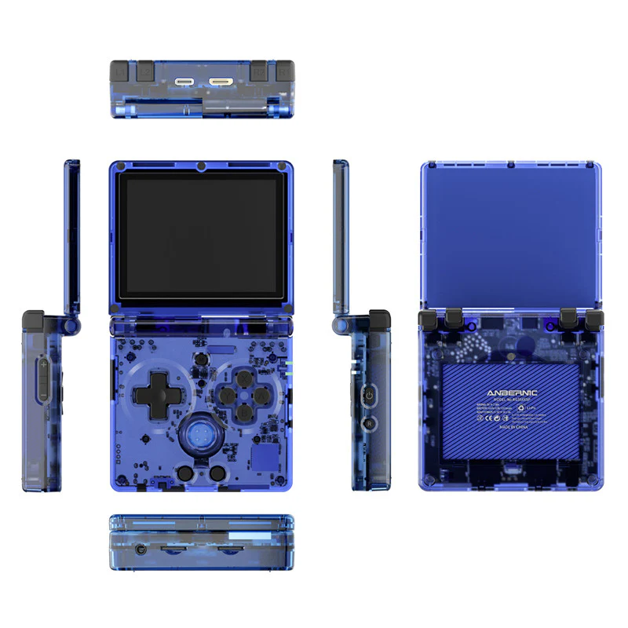

# What ? Why ? How ?

## What ?

The <mark style="color:purple;">RG35XX SP</mark> is a wonderful retro handheld manufactured and sold by Anbernic.\
It's based on the same <mark style="color:blue;">RG35XX</mark> platform as both the <mark style="color:red;">RG35XX Plus</mark> and <mark style="color:green;">RG35XX H</mark>.

<figure><figcaption>
RG35XX SP Transparent Blue
</figcaption></figure>

### Technical Specifications

<table data-header-hidden><thead><tr><th></th><th width="249"></th></tr></thead><tbody><tr><td><strong>CPU</strong></td><td>Allwinner H700 - Quad Core A53 @ 1.5GHz</td></tr><tr><td><strong>GPU</strong></td><td>Mali G31 - Dual Core</td></tr><tr><td><strong>RAM</strong></td><td>1GB LPDDR4</td></tr><tr><td><strong>Screen</strong></td><td>3.5" IPS - 640 * 480</td></tr><tr><td><strong>Misc</strong></td><td>Wi-Fi, Bluetooth, Built-in Hall switch chip for the lid </td></tr></tbody></table>

## Why ?

The RG35XXSP is a wonderful retro handheld but the stock OS isn't the best it could be.\
I would like to achieve a better sleep system, switch the frontend for something like ES-DE and maybe optimize the SoC's clocks to better suit my needs.

## How ?
